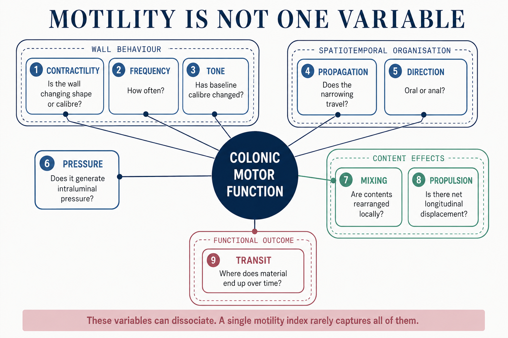
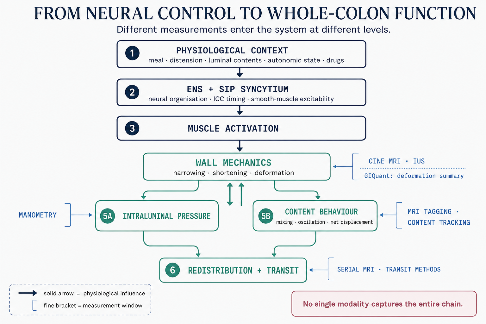
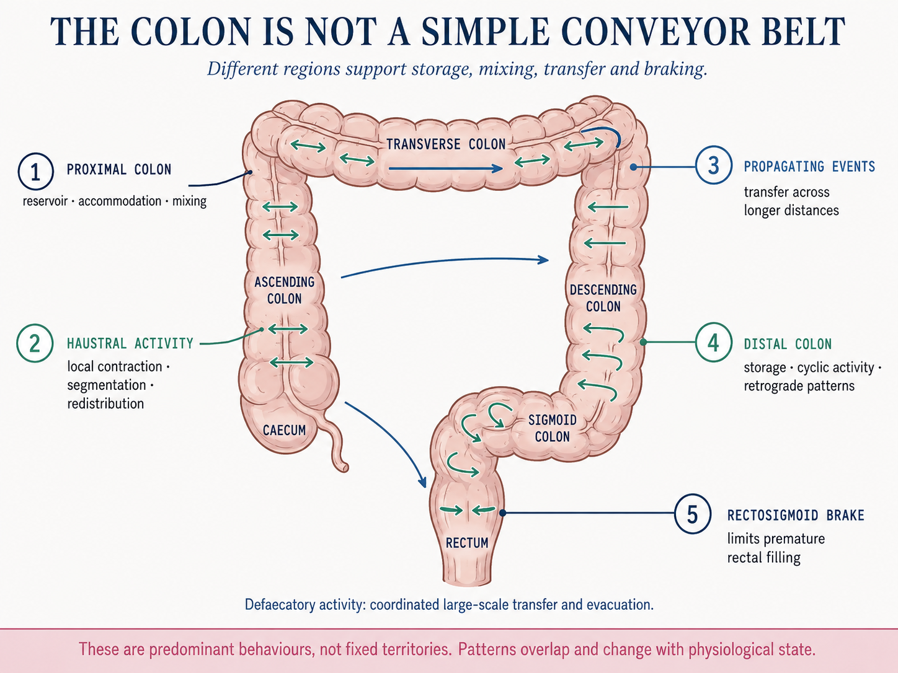
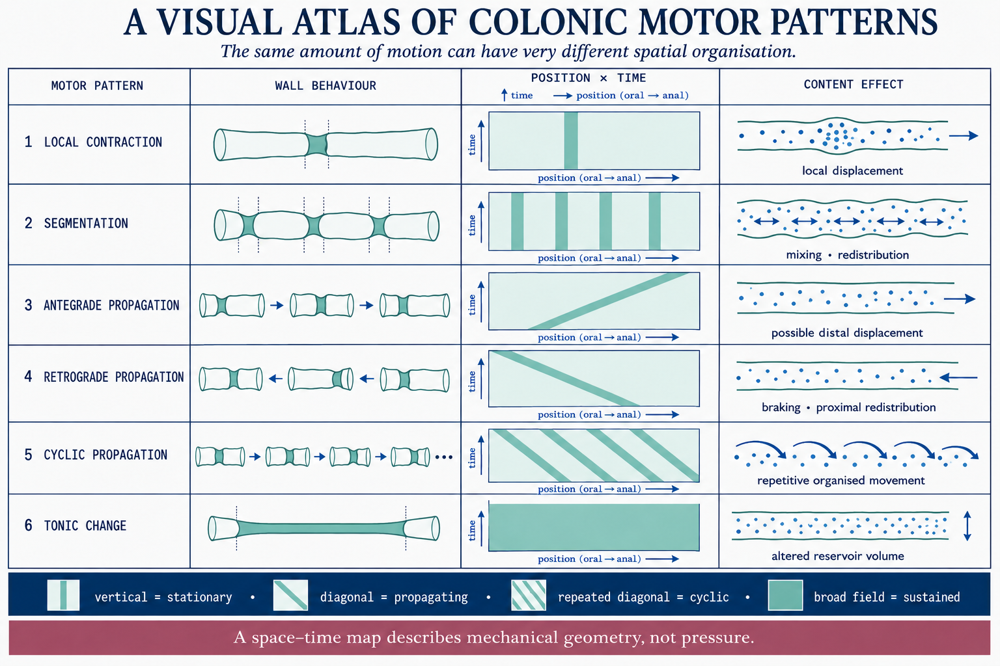
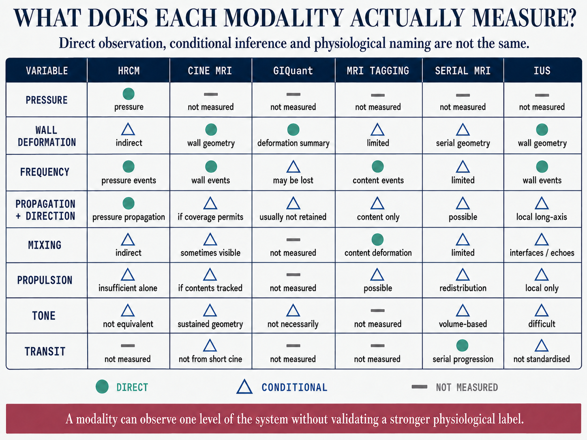
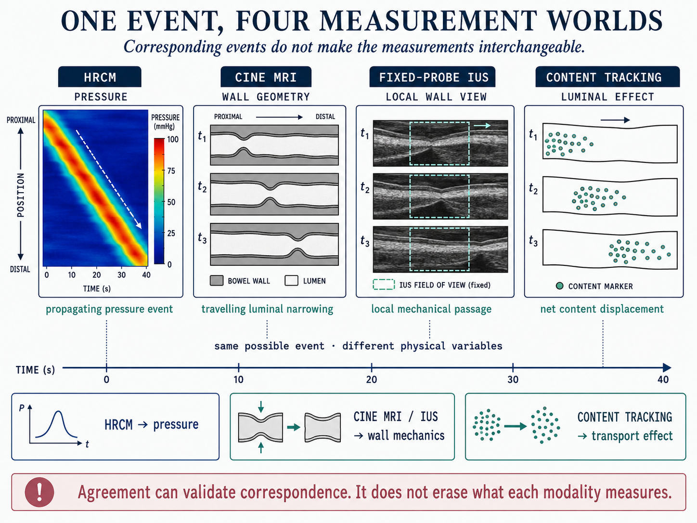
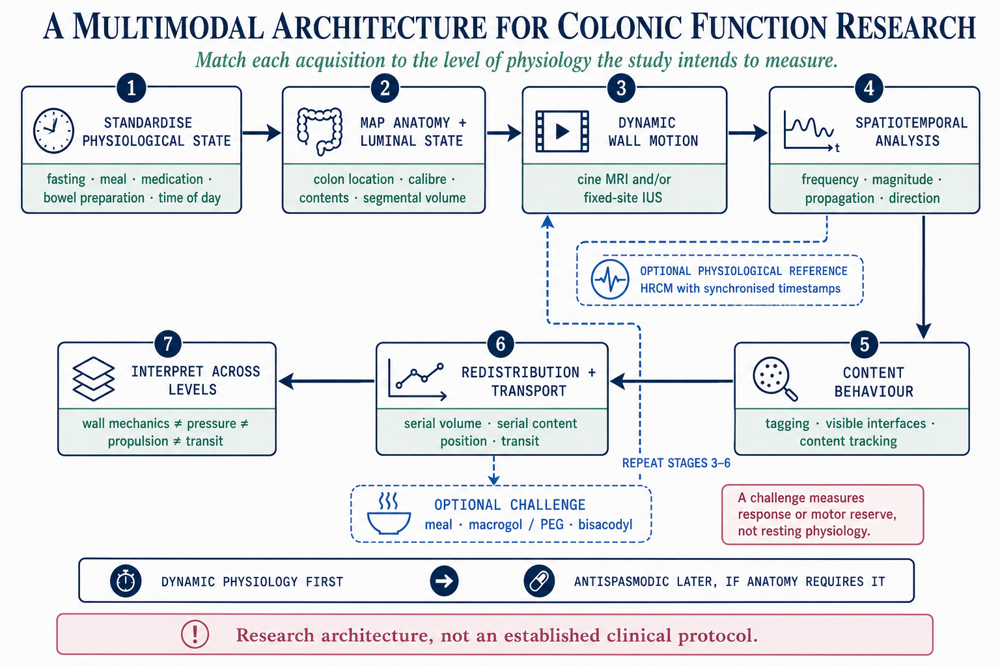
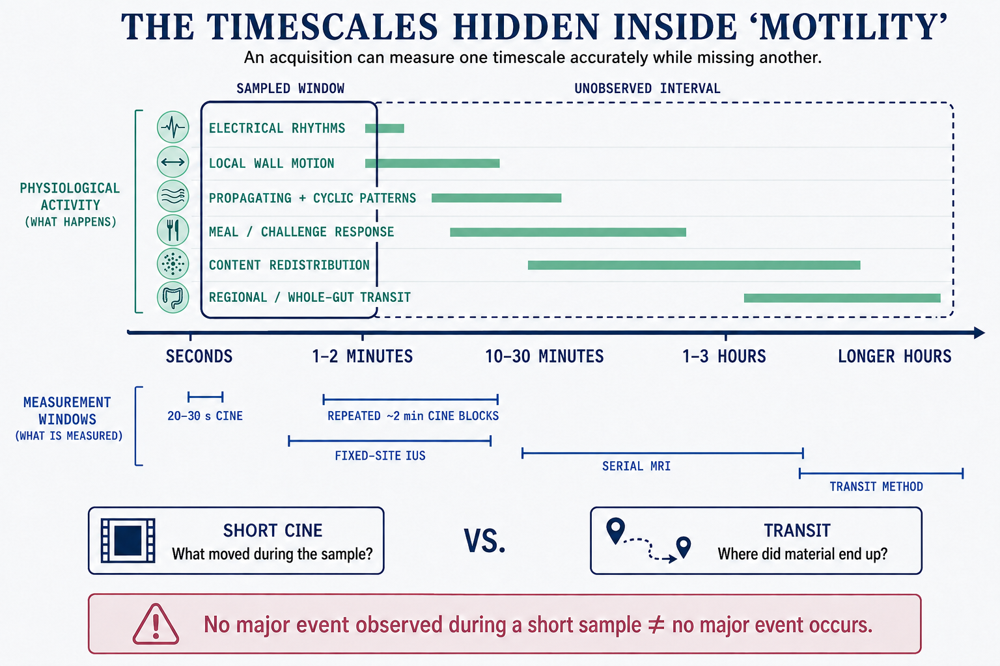
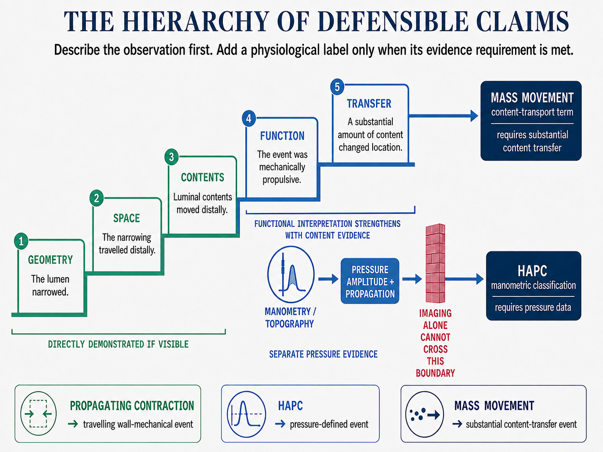
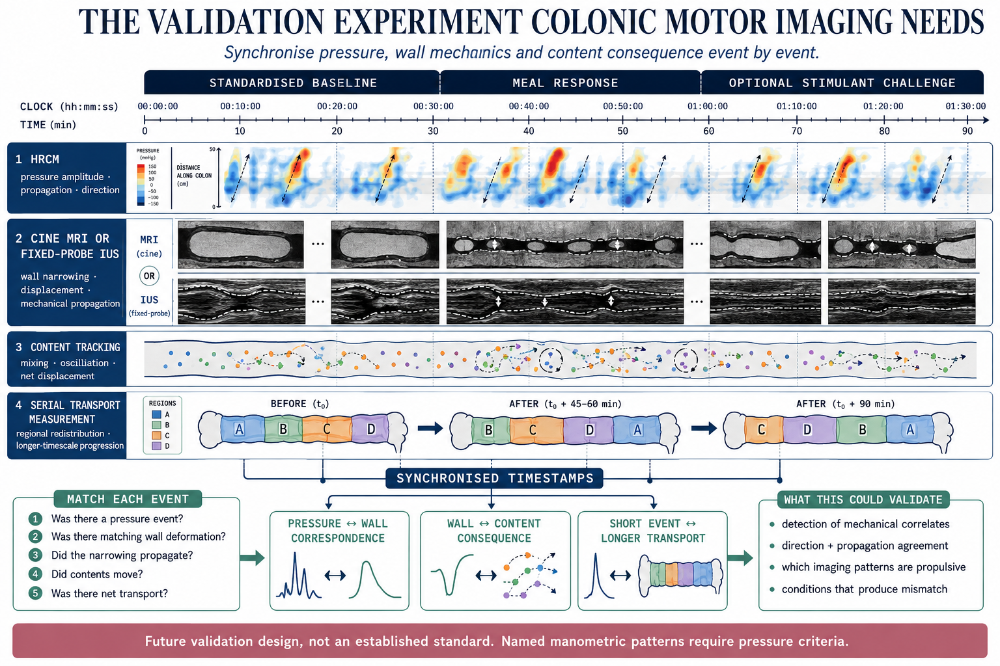

::: {.note-page-meta}
[🌲 evergreen]{.maturity-tag .evergreen} · Planted May 14, 2026 · Last tended September 6, 2026
:::

Much of my recent work in ulcerative colitis has involved quantitative colonic motility on MRI.

At first, the question seemed simple:

**Does an inflamed colon move differently?**

The difficulty started when I tried to define *motility*.

The word is used for several different things. Electrical and neuromuscular activity. Contraction of the bowel wall. Propagation of those contractions. Movement of luminal contents. Transit through the colon. In clinical conversations, it can stretch even farther and become almost synonymous with bowel habit.

These processes are connected. They are not interchangeable.

The distinction becomes much more important once you try to put a number on bowel movement. A quantitative value looks precise, but its biological meaning still depends on which part of the system produced it.

{fig-alt="Motility is not one variable" width="100%"}

## I started by treating motility as one variable

Normal colonic motor function starts long before a contraction becomes visible.

Interstitial cells of Cajal, smooth muscle cells and enteric neural circuits influence when and where the bowel contracts. Electrical slow-wave activity contributes to the timing, but electrical activity alone is not a contraction. Neural excitation and inhibition, distension and the state of the smooth muscle all determine whether that upstream activity becomes mechanical movement.

What we see as a contraction is already several steps downstream of the neural and muscular machinery producing it.

{fig-alt="From neural control to whole-colon function" width="100%"}

Even a visible contraction tells us only part of the story.

Some contractions stay local. A haustrum narrows, contents shift a little, and then shift back. Other contractions propagate along the colon. Propagation itself can be antegrade or retrograde. Retrograde cyclic activity in the distal colon is part of normal physiology and may help delay rectal filling, the so-called rectosigmoid brake. At the other extreme, relatively rare high-amplitude propagated contractions can accompany large-volume distal movement and defaecation.

The colon also has tone: a sustained background contractile state on which these faster events occur.

So a healthy colon is not a conveyor belt that simply becomes faster or slower.

{fig-alt="The colon is not a simple conveyor belt" width="100%"}

The distinction I initially underestimated was this:

**Contraction is not the same as propagation. Propagation is not the same as propulsion. Propulsion is not the same as transit.**

A colon can contract frequently and still move very little material forward. Repeated local or alternating contractions may mainly mix contents. One relatively infrequent propagating event can do much more transport work.

Two colons could therefore show a similar amount of visible wall movement while behaving very differently as transport systems.

{fig-alt="Four levels hidden inside the word motility" width="100%"}

High-resolution manometry made these patterns much easier to separate because it measures pressure across space and time. MRI measures something else.

## Then I had to ask what MRI actually sees

Cine MRI repeatedly images the bowel over time. What we see directly is mechanical: changes in wall position, luminal diameter and bowel shape.

Manometry measures pressure.

Cine MRI measures movement and deformation.

MRI tagging can go one step farther and show deformation of the contents inside the lumen. Serial imaging over longer periods can measure changes in segmental volume or movement of contents.

These measurements overlap physiologically, but they are not substitutes for one another.

That became clearer to me when I looked at simultaneous MRI-manometry studies. Large contractions can appear on both techniques, but a pressure event does not always produce conspicuous wall movement in the selected MRI plane. The reverse inference is also unsafe: visible deformation does not by itself tell us the pressure that generated it.

There is also a much simpler limitation: with a short cine acquisition, the event may simply happen outside the acquisition.

GIQuant sits at the wall-motion part of this hierarchy.

{fig-alt="Where GIQuant fits in the motor hierarchy" width="100%"}

GIQuant uses non-rigid image registration to estimate deformation through a cine time series. The temporal variation in the Jacobian determinant of the deformation field is used to generate a motility map, from which a region of interest can be summarized numerically.

In [our UC work](/work/studies/uc-motility/), we applied that measurement by colonic segment.

I used to think about the resulting number almost as a compact description of how active the segment was. I think that is too broad.

The number has a more specific meaning: it summarizes the amount of image deformation occurring within the selected region during the acquired cine sequence.

But one regional number inevitably discards some of the pattern.

A similar regional value could, in principle, arise from several different patterns: many small local deformations, a smaller number of stronger events, movement concentrated in one part of the ROI, or more spatially distributed movement. The score alone does not tell me whether a narrowing travelled along the colon, whether it travelled antegrade or retrograde, whether the contents moved with it, or whether any movement resulted in meaningful transit.

So a low GIQuant value is safest to read as:

**less regional image deformation during the recorded cine period.**

It does not directly mean reduced neural activity, lower contraction pressure, impaired propagation, reduced propulsion or slow transit. Any of those may contribute. The score itself does not establish which one did.

This is not really a criticism of GIQuant. It is a consequence of summarising complex motion with one regional metric. The question is what information the score retains.

## Then time complicated the picture

There is another problem: time.

**When did we measure it?**

Colonic motor activity is intermittent. Some rhythmic patterns operate over seconds. Meal responses develop over minutes. Large propulsive events are much less frequent. Transit belongs to a far longer timescale again. Chronic bowel remodelling develops over months or years.

In our UC protocol, the GIQuant measurement comes from a short cine acquisition of roughly 20 seconds.

That is not a limitation of the GIQuant algorithm itself. It is a property of how we sampled the colon.

A 20-second acquisition can measure those 20 seconds very well and still leave open the question of how representative those seconds are of the segment's behaviour more generally.

{fig-alt="The timescales hidden inside motility" width="100%"}

I now think a short cine is better treated as a **sample** rather than automatically as a stable property of the segment.

Repeated short acquisitions could ask whether a low-motion phenotype is persistent or intermittent. A meal or standardized challenge would ask something different again: how the motor system responds when stimulated.

Those are not equivalent measurements.

A colon could be quiet during one resting acquisition and respond normally after a meal. Another could be quiet at baseline and remain quiet after stimulation. Calling both simply "low motility" would throw away a potentially meaningful difference.

This is where protocol becomes part of construct validity.

A fasting acquisition asks: **what happened spontaneously during this observation?**

Repeated acquisitions ask: **how stable is that observation over time?**

A stimulated acquisition asks: **how much can this system respond?**

Using the same analysis after a meal does not mean we are measuring the same physiological state.

{fig-alt="Protocol is part of construct validity" width="100%"}

## UC gives the same measurement several possible causes

UC adds another layer of ambiguity.

I used to think of active and chronic UC as two fairly clean explanations for altered motility: active inflammation interferes with normal movement, while chronic fibrosis makes the bowel mechanically stiff.

That division is too clean.

Active inflammation can alter enteric neural signalling and smooth-muscle behaviour. Classical physiology studies did not describe a colon that was simply "hyperactive." They found lower overall pressure activity, abnormal propagating patterns, proximal stasis and relatively rapid rectosigmoid transit in active disease.

The motor problem is regional.

A patient can therefore have frequent stools and rapid distal delivery while material is relatively delayed farther upstream.

UC can also leave a longer-lasting footprint. Colectomy studies have described submucosal fibrosis, muscular changes and alterations in myenteric neurons, glial cells and interstitial cells of Cajal. MRI studies have found persistent abnormalities in wall thickness, calibre and morphology even when endoscopic inflammation is minimal.

Inflammation affects function directly.

Repeated inflammation can also change the structure and neuromuscular machinery that generate that function.

So structure and motility are not really competing explanations. Structural remodelling may be one route through which motor behaviour changes.

{fig-alt="Inflammation, chronic remodelling and regional motility" width="100%"}

This is also how I now interpret our own results.

In our UC cohort, lower cine-MRI motility was associated with greater endoscopic activity. Lower motility was also associated with chronic structural features including loss of haustration and pericolic fat changes.

At the cohort level, the same imaging measurement therefore carried information related to both current disease activity and accumulated disease phenotype.

But that does not mean that every low value in an individual segment represents both.

Imagine three segments with similarly low GIQuant values.

One is actively inflamed.

One is endoscopically quiet but chronically ahaustral and structurally abnormal.

One looks structurally quiet and happened to be observed during a particularly inactive 20-second window.

All three could have a low score, for very different reasons.

## It also explains why motility studies can disagree

Some of the motility literature looks contradictory at first.

But often the studies are measuring different things and calling all of them motility.

A manometry study measuring pressure is not measuring the same thing as a cine-MRI study measuring deformation. A transit study is farther downstream again.

A study of the sigmoid is not interchangeable with one centred on the ascending colon, especially in a system where antegrade, retrograde and local behaviour all have physiological roles.

Fasting and post-meal measurements describe different states. Twenty seconds, two minutes and repeated observations have different probabilities of catching intermittent events. Active inflammation, remission and chronic structural damage create different biological contexts.

Even the level of analysis matters. A segment-level measurement can be anatomically matched to local inflammation. Symptoms such as urgency belong to the patient.

So when two studies report different relationships between "motility" and disease activity, the first question should probably not be *which one is right?*

It should be:

**What did each of them actually measure?**

That sounds obvious. It was not obvious to me at the beginning.

## Symptoms sit another step downstream

The other jump I was making was from abnormal movement directly to symptoms.

UC symptoms do not work that way either.

Urgency is the clearest example.

Something has to deliver contents toward the distal colon and rectum. But what happens when those contents arrive depends strongly on the rectum itself. Active UC can reduce rectal compliance and lower the volume needed to produce sensations of filling and urgency. Visceral sensitivity adds another layer.

The same volume entering two rectums can therefore produce very different experiences.

{fig-alt="Delivery and reception both contribute to symptoms" width="100%"}

Frequency can reflect repeated distal delivery, inflammation, stool consistency and reduced effective rectal capacity. Bloating can coexist with urgency if proximal retention occurs alongside rapid distal transit. Pain depends partly on inflammation and distension, but also on how strongly those signals are perceived.

Two patients could therefore have similar cine-MRI motility and very different symptoms.

Abdominal MRI is well placed to observe several things upstream of those symptoms: inflammatory change, morphology and wall motion.

It cannot directly measure urgency.

It cannot tell me how painful a given amount of distension feels.

And routine MRI does not measure true rectal compliance, which is a pressure-volume relationship.

Symptoms need their own measurement.

This is why I now find a simple motility-symptom correlation interesting, but incomplete. If an association exists, it tells me that the imaging measurement carries clinically related information. It does not tell me which route connected the scanner to the patient's experience.

## So what do I mean by motility now?

After two years of working with the word, I am much less comfortable using it without qualifiers.

If someone tells me that colonic motility is reduced, I now want to know:

Reduced **what**?

Pressure activity?

Visible wall deformation?

Propagation?

Content movement?

Transit?

In which part of the colon?

Fasting or stimulated?

Observed for how long?

And in UC, is the measurement sitting in a segment with active inflammation, chronic structural change, both, or neither?

None of this makes the measurement less useful to me. It just makes the question more specific.

GIQuant gives us something conventional static MRI cannot: a quantitative window onto regional bowel movement.

The harder part is deciding what we can infer from that measurement, and what still has to be measured separately.

**inflammation and chronic remodelling → neuromuscular and mechanical behaviour → image-visible deformation → movement of contents and transit → symptoms**

{fig-alt="From disease biology to clinical meaning without skipping levels" width="100%"}

GIQuant measures one part of that chain.

So my original question, *does an inflamed colon move differently?*, now feels too broad.

I still want to know why regional deformation is lower in some UC segments. I want to know how much of that reduction follows current inflammation and how much persists with chronic remodelling. I want to know whether repeated observations reveal something that one short cine misses, and whether a stimulated response tells us something different from resting movement.

And eventually, I want to know whether those motor phenotypes explain anything about how patients actually feel beyond what inflammation and structure already tell us.

The word *motility* covers too many steps for that question to be enough.

For me, motility MRI became more interesting once I stopped treating it as one variable and started asking what, exactly, was moving.

::: {style="font-size: 0.85em; font-style: italic;"}
**Figure note:** The concepts and scientific content of the figures are my own. The figures were created with assistance from OpenAI's ChatGPT image-generation tools.
:::

---

::: {style="font-size: 0.85em;"}
## References

1. Corsetti M, Costa M, Bassotti G, et al. First translational consensus on terminology and definitions of colonic motility. *Nat Rev Gastroenterol Hepatol.* 2019;16:559–579. <https://doi.org/10.1038/s41575-019-0167-1>

2. Spencer NJ, Dinning PG, Brookes SJH, Costa M. Insights into the mechanisms underlying colonic motor patterns. *J Physiol.* 2016;594:4099–4116. <https://doi.org/10.1113/JP271919>

3. Huizinga JD, Hussain A, Chen J-H. Interstitial cells of Cajal and human colon motility in health and disease. *Am J Physiol Gastrointest Liver Physiol.* <https://doi.org/10.1152/ajpgi.00264.2021>

4. Dinning PG, et al. Quantification of in vivo colonic motor patterns in healthy humans before and after a meal revealed by high-resolution fibre-optic manometry. *Neurogastroenterol Motil.* 2014;26:1443–1457. <https://doi.org/10.1111/nmo.12408>

5. Lin AY, et al. High-resolution anatomic correlation of cyclic motor patterns in the human colon: evidence of a rectosigmoid brake. *Am J Physiol Gastrointest Liver Physiol.* 2017;312:G508–G515. <https://doi.org/10.1152/ajpgi.00021.2017>

6. Kirchhoff S, et al. Assessment of colon motility using simultaneous manometric and functional cine-MRI analysis: preliminary results. *Abdom Imaging.* 2011;36:24–30. <https://doi.org/10.1007/s00261-010-9599-3>

7. Hoad CL, et al. Colon wall motility: comparison of novel quantitative semi-automatic measurements using cine MRI. *Neurogastroenterol Motil.* 2016;28:327–335. <https://doi.org/10.1111/nmo.12727>

8. Pritchard SE, et al. Assessment of motion of colonic contents in the human colon using MRI tagging. *Neurogastroenterol Motil.* 2017;29:e13091. <https://doi.org/10.1111/nmo.13091>

9. Menys A, Hoad C, Spiller R, et al. Spatio-temporal motility MRI analysis of the stomach and colon. *Neurogastroenterol Motil.* 2019;31:e13557. <https://doi.org/10.1111/nmo.13557>

10. Vriesman MH, et al. Simultaneous assessment of colon motility in children with functional constipation by cine-MRI and colonic manometry. *Eur Radiol Exp.* 2021;5:8. <https://doi.org/10.1186/s41747-021-00205-5>

11. Rao SS, Read NW. Gastrointestinal motility in patients with ulcerative colitis. *Scand J Gastroenterol Suppl.* 1990;172:22–28. <https://doi.org/10.3109/00365529009091905>

12. Reddy SN, et al. Colonic motility and transit in health and ulcerative colitis. *Gastroenterology.* 1991;101:1289–1297. <https://doi.org/10.1016/0016-5085(91)90079-Z>

13. Cleveland NK, et al. Ulcerative Colitis Patients Have Reduced Rectal Compliance Compared With Non-IBD Controls. *Gastroenterology.* 2022;162:331–333.e1. <https://doi.org/10.1053/j.gastro.2021.09.052>

14. Gordon IO, et al. Fibrosis in ulcerative colitis is directly linked to severity and chronicity of mucosal inflammation. *Aliment Pharmacol Ther.* 2018;47:922–939. <https://doi.org/10.1111/apt.14526>

15. Bernardini N, et al. Immunohistochemical analysis of myenteric ganglia and interstitial cells of Cajal in ulcerative colitis. *J Cell Mol Med.* 2012;16:318–327. <https://doi.org/10.1111/j.1582-4934.2011.01298.x>

16. Rimola J, et al. Magnetic Resonance Imaging Features Indicative of Permanent Colon Damage in Ulcerative Colitis: An Exploratory Study. *J Crohns Colitis.* 2024;18:1690–1700. <https://doi.org/10.1093/ecco-jcc/jjae075>

17. Sarikhani M, et al. Quantitative assessment of colon motility in ulcerative colitis using magnetic resonance enterography: correlation with endoscopic disease activity. *J Crohns Colitis.* 2025;19(Suppl 1). <https://doi.org/10.1093/ecco-jcc/jjae190.0729>

18. Wilkinson-Smith V, et al. The MRI colonic function test: reproducibility of the Macrogol stimulus challenge. *Neurogastroenterol Motil.* 2020;32:e13942. <https://doi.org/10.1111/nmo.13942>

19. Wilkinson-Smith V, et al. Combined MRI, high-resolution manometry and a randomised trial of bisacodyl versus hyoscine: the RECLAIM study. *Gut.* 2025;74:35–44. <https://doi.org/10.1136/gutjnl-2024-332755>
:::
